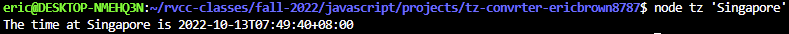
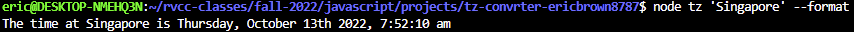
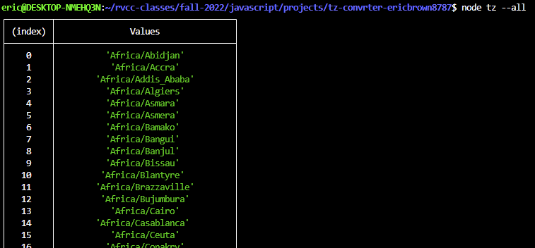
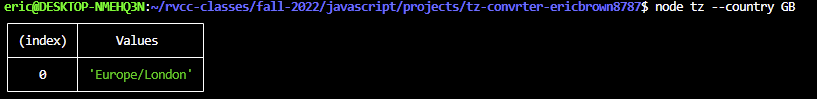

# Time Zone Converter

---

This command line utility converts the default time zone('America/New_York') to a specified time zone.

## Usage

---

To display a the current time in a specified timezone:

```
  node tz <timezone> [--format]
```
**Example:**



If the optional ```--format``` flag is included, the time and date will be formatted. Otherwise, the time and date will display without any formatting.

**Example(with formatting):**



---

To display a table listing all valid timezones:

```
  node tz --all
```

**Example:**



---

To display a table of the timezone(s) associated with a particular two-character country code:

```
  node tz --country <country code>
```

**Example:**



## Sources

---

[Java Brains: Writing command line script in Node.js from scratch](https://www.youtube.com/watch?v=B047pkqRCak)

[techsith: Passing Command Line Arguments Node.js](https://www.youtube.com/watch?v=5aT02ihNueU)